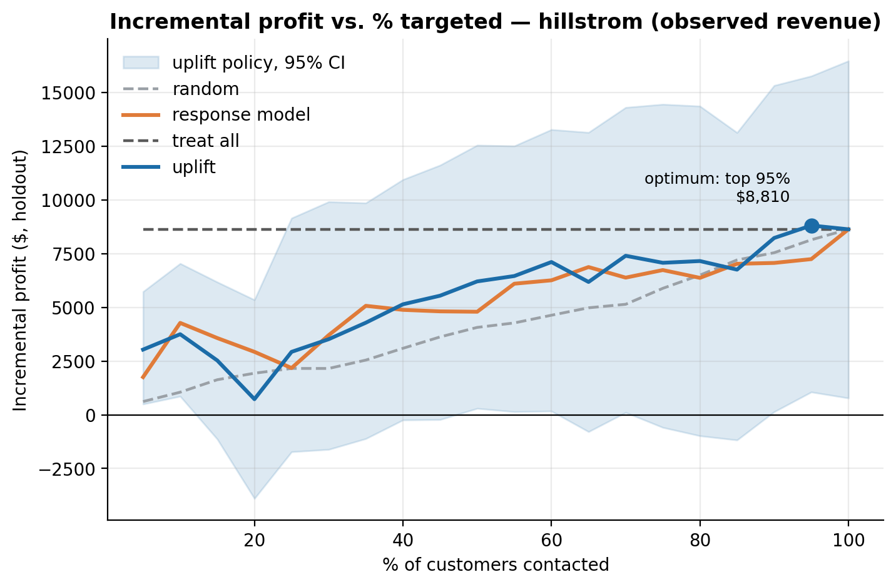
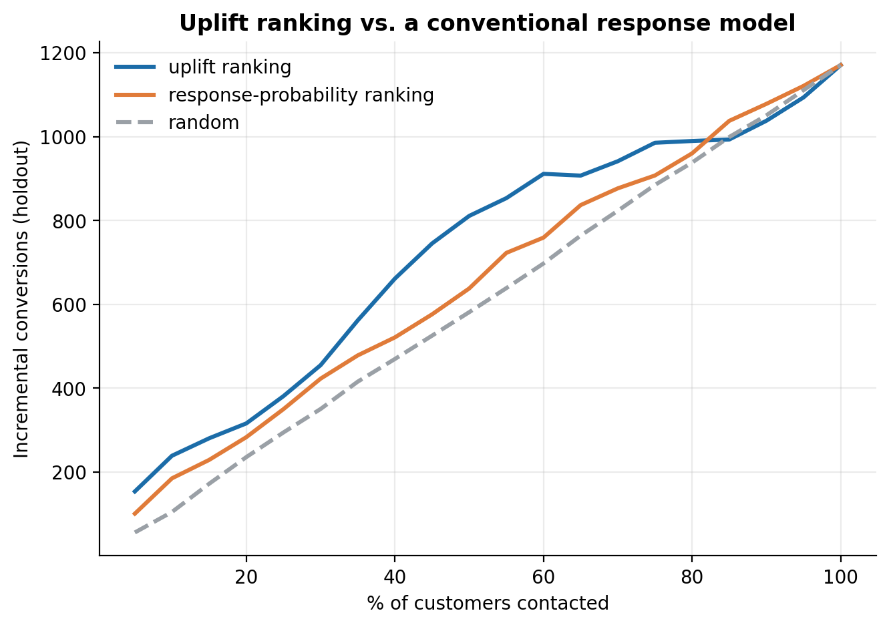
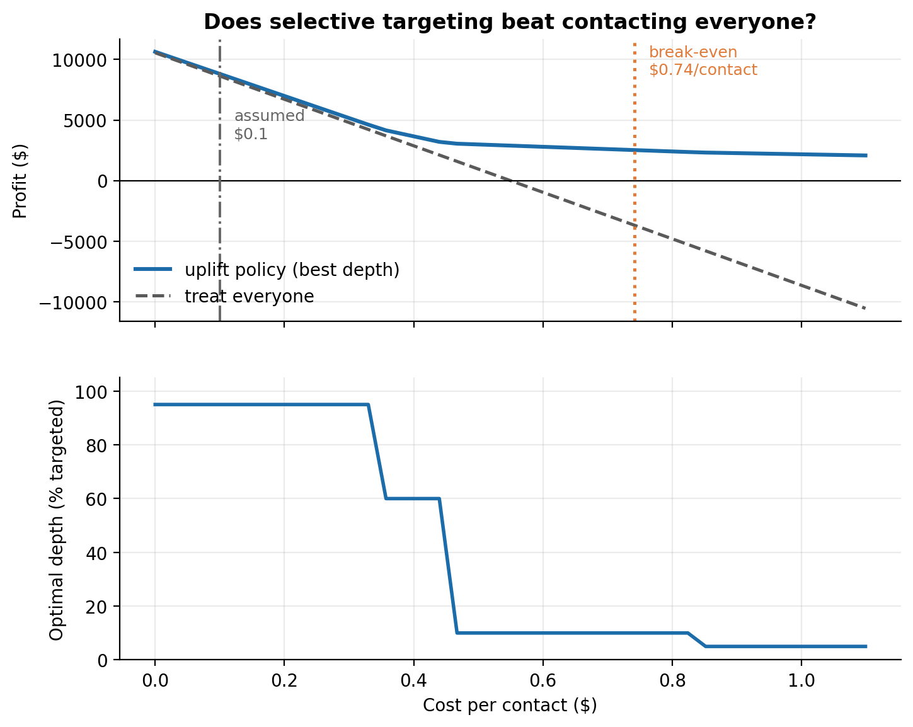
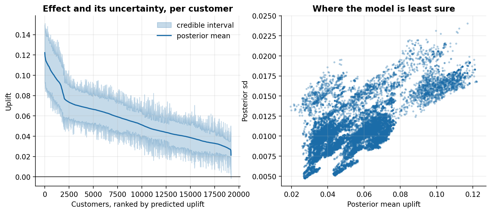
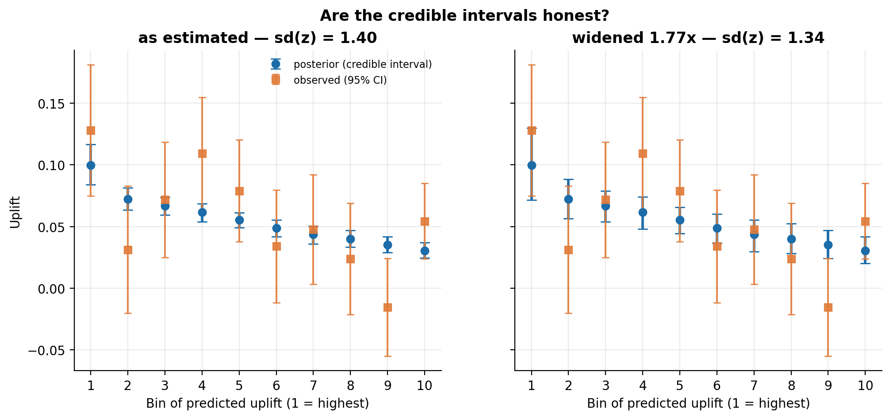
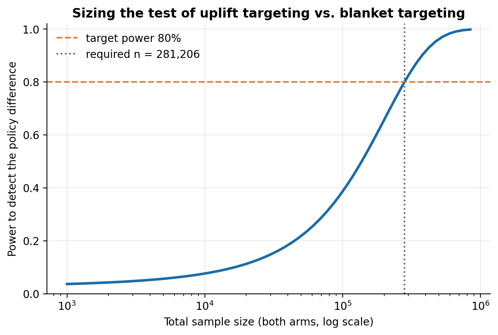

# Uplift Modeling & Incremental Impact Simulator

**Finds the customers whose behaviour actually changes because of a marketing
offer — not the ones who were going to convert anyway.** A churn or response
model ranks people by *P(convert)*. That ranking puts your most loyal customers
at the top, and spends the budget on people who needed no persuading. This system
estimates the *causal effect of contacting each customer*, validates it against
randomized holdout data, and prices the resulting targeting policy in dollars.

<!-- ---------------------------------------------------------------------
     WALKTHROUGH VIDEO — not recorded yet.

     When the Loom exists, delete this comment block and paste the two lines
     below into its place (swap in the real share URL):

**[▶ 3-minute walkthrough](https://www.loom.com/share/PASTE_ID_HERE)** — the
problem, the Qini validation, and the break-even result that decides the policy.

     A shot-by-shot script with timings and the exact numbers to quote is in
     docs/walkthrough_script.md. Recording notes: use the Loom share link, not
     the embed URL; GitHub will not play an embedded iframe, so a plain link
     with a thumbnail is the only thing that works in a README.
     --------------------------------------------------------------------- -->

---

## The money chart



Incremental profit on a 19,200-customer randomized holdout as targeting deepens.
The uplift policy beats random targeting by **+8.2%** at its optimum and out-earns
the response model at 12 of 20 depths (mean $5,573 vs $5,334). The shaded band is
the bootstrap 95% interval — and it is wide, which is the honest headline: this
basis differences a heavy-tailed spend variable inside every slice, so much of the
depth-to-depth wobble is noise, not signal.

The ranking comparison is far cleaner on incremental conversions, which is the
model-quality view rather than the money view:



Here the uplift model leads at **every depth from 5% to 80%** — 661 incremental
conversions vs 521 at the 40% mark — and the two converge above that, as both
policies approach contacting everyone.

The interesting result is what happens when contact isn't free:



Incremental revenue is **$0.583 per contact** at the optimum. Below roughly
**$0.74 per contact**, blanket targeting wins and no model changes that. Above it,
selective targeting takes over and the optimal campaign narrows sharply: at $0.74
the policy targets the top 10% for **+168% profit** over contacting everyone, and
by $0.85 it has narrowed to the top 5%. On Criteo — now at full scale, all
13,979,592 rows — the break-even is **$0.039/contact** against $0.259 incremental
revenue; at $0.14 the policy targets the top 40% for **+$265,371 (+54%)**, and
past $0.27 a blanket campaign *loses money* (−$54,222) while the targeted one
still earns **$600,278**.

"Beats" here means the bootstrap lower bound clears zero, not just the point
estimate. Without that guard the sweep reports a break-even of $0.00, because at
zero cost some slice of the holdout always out-earns the full population by a few
dollars of noise. Reporting the break-even rather than picking a flattering cost
assumption is the difference between a model that sounds valuable and one you can
act on.

---

## The problem

A campaign's average effect hides four different customer types:

| Segment | Converts if contacted | Converts if left alone | Action |
|---|---|---|---|
| **Persuadable** | yes | no | **Target.** The only group the spend moves. |
| **Sure thing** | yes | yes | Skip. You paid for a conversion you already had. |
| **Lost cause** | no | no | Skip. Nothing reaches them. |
| **Sleeping dog** | no | yes | **Suppress.** Contact actively hurts. |

A response model cannot tell persuadables from sure things — both convert when
contacted, so both rank high. Only the causal effect separates them.

**This is measurable, not theoretical.** Before any modelling, in the raw
Hillstrom data:

| Zip code | Response rate (treated) | Actual uplift |
|---|---|---|
| Rural | **0.205** (highest) | 0.052 (lowest) |
| Suburban | 0.161 | 0.062 |
| Urban | 0.160 | **0.063** (highest) |

A response model targets rural customers first. They are the *worst* group to
spend on. `scripts/01_explore.py` scans every feature for reversals like this.

---

## Method

**Five learners**, four implemented directly on LightGBM rather than pulled from
`causalml` — the S/T/X distinction is a few lines of bookkeeping around ordinary
classifiers, and writing the X-learner out makes its propensity weighting visible
instead of hidden behind a constructor argument.

| Learner | Idea | Weakness it exposes |
|---|---|---|
| **S-learner** | One model, treatment as a feature | Can decline to split on treatment and predict ~0 uplift everywhere |
| **T-learner** | Separate model per arm | Each model sees half the data; noise adds rather than cancels |
| **X-learner** | Impute effects cross-arm, weight by propensity | Best when arms are very unbalanced |
| **Class transform** | Relabel and fit one model | Cheap benchmark: if it ties, the machinery isn't earning its keep |
| **Causal forest** | `econml`'s `CausalForestDML` | The purpose-built method — included to test whether it actually wins |

The causal forest is optional and auto-detected: if `econml` is not installed the
pipeline prints a note and carries on, because a heavy pinned dependency should
never be the reason a fresh clone fails to run.

**Evaluation is the Qini curve**, not AUC. The predicted quantity — a difference
of two potential outcomes — is never observed for any individual, so there is no
label to score against. What *is* available is the randomized holdout, where
treated and control customers with similar predicted uplift are exchangeable by
construction. Qini is implemented from scratch in `src/uplift/evaluate.py`,
including the treated/control rescaling that makes it valid off a 50/50 split.

Two implementation details that matter:

- **Model selection uses repeated cross-validation, not the holdout.** Bootstrap
  Qini intervals on 19K rows overlap for every learner, so whichever model wins a
  single split is close to a coin flip. The winner is reported with whether it is
  actually separated from the runner-up.
- **The Qini coefficient returns NaN when there is no effect to allocate.** It
  divides by the total incremental outcome; on an experiment with no effect that
  is noise over noise, and it will happily return 1.2 — reading as a near-perfect
  model on an experiment where nothing happened.

---

## Results

### Hillstrom (64,000 customers, email vs. no-email, outcome = site visit)

| Model | Qini (holdout) | 95% CI | CV Qini | AUUC | Fit |
|---|---|---|---|---|---|
| **S-learner** | **0.188** | [0.109, 0.272] | **0.128 ± 0.016** | 1.192 | 0.2s |
| X-learner | 0.135 | [0.042, 0.214] | 0.077 ± 0.019 | 1.138 | 0.9s |
| T-learner | 0.111 | [0.025, 0.204] | 0.090 ± 0.021 | 1.115 | 0.4s |
| Causal forest (`econml`) | 0.103 | [-0.005, 0.195] | 0.070 ± 0.018 | 1.103 | 4.5s |
| Class transform | 0.094 | [0.007, 0.175] | 0.100 ± 0.024 | 1.101 | 0.2s |
| *Response model* | *0.076* | *[-0.014, 0.177]* | — | *1.081* | — |

`CausalForestDML` is the method built specifically for this problem, and it
finishes fourth — 20× the fit time of the S-learner for a Qini whose interval
includes zero. On 44,800 rows with 11 features there is not enough effect
heterogeneity to repay its flexibility. It is included because that result is
worth knowing, not because it wins.

The naive response model's Qini interval **includes zero**: as a way of finding
incremental effect, it is not distinguishable from random targeting.

The S-learner wins, and is separated from the runner-up by more than the combined
standard error. That is the opposite of the usual expectation, and the reason is
instructive: with 11 features and a fairly homogeneous effect, pooling both arms
into one model buys more from the extra data than it loses to the treatment
feature being diluted. The T- and X-learners pay the variance cost of splitting
44,800 rows in two and get nothing back for it. The base learners are also
regularized far harder than they would be for classification (`num_leaves=7`,
`min_child_samples=800`) — uplift is a *difference* of small probabilities, so
variance in either arm lands directly on the estimate. `scripts/02a_tune.py`
shows this doubles CV Qini.

**Segments, validated on the holdout** — these are observed treated-minus-control
gaps, not predictions:

| Segment | Share | Observed uplift | 95% CI | Significant |
|---|---|---|---|---|
| Persuadable | 50.0% | **+0.085** | [+0.070, +0.100] | yes |
| Lost cause | 30.5% | +0.048 | [+0.035, +0.062] | yes |
| Sure thing | 19.5% | **+0.019** | [-0.007, +0.045] | **no** |

The sure-thing group has the highest do-nothing rate (16.4%) and an incremental
effect indistinguishable from zero. Contacting them is close to pure cost, and
that is the budget the policy frees up.

**No sleeping dogs.** The model predicts a negative effect for 0 of 19,200
customers, and every subgroup in the raw data shows a positive effect. Reported as
found rather than manufactured — on this campaign the heterogeneity is in
magnitude, not sign.

### Criteo (full dataset — all 13,979,592 rows, real ad-exposure experiment)

9,785,714 train / 4,193,878 test, 85:15 treated/control.

| Model | Qini (holdout) | 95% CI | CV Qini | AUUC | Fit |
|---|---|---|---|---|---|
| **X-learner** (selected) | **0.733** | [0.708, 0.765] | **0.726 ± 0.010** | 1.726 | 28.0s |
| S-learner | 0.711 | [0.696, 0.725] | 0.704 ± 0.003 | 1.706 | 10.6s |
| T-learner | 0.700 | [0.670, 0.730] | 0.713 ± 0.013 | 1.694 | 9.9s |
| Class transform | 0.692 | [0.678, 0.705] | 0.695 ± 0.005 | 1.688 | 14.8s |
| *Response model* | *0.689* | *[0.675, 0.703]* | — | *1.685* | — |

The causal forest is absent from this table by necessity, not choice — see the
five-way comparison below, which is the largest sample it fits on.

**Ten times the data half-resolved the tie, and that is worth being precise
about.** On the earlier 10% sample the top three learners scored 0.6697 / 0.6690
/ 0.6686 — gaps of 0.001, pure noise. At full scale they are 0.7260 / 0.7128 /
0.7042, with confidence intervals **3.8× narrower** (X-learner 0.215 → 0.056,
close to the √10 ≈ 3.2 expected). That is enough to separate the X-learner from
the S-learner at **2.2 combined standard errors** — a real ranking where the
sample could establish none — but *not* from the T-learner, its nearest rival, at
0.81 SE. So `select_best_cv` still calls it a tie, correctly, and the tie is
still broken on the X-learner's propensity weighting being the right tool for an
85:15 split.

CV Qini also rose across the board (~0.67 → ~0.73): the models genuinely improved
with more data, they were not merely measured more precisely.

Criteo flags 0.6% of customers as sleeping dogs, but their observed holdout CI
includes zero, so the negative effect is not confirmed. The segmentation
otherwise validates cleanly on 4.2M held-out rows: persuadables +0.0197
[+0.0187, +0.0206], versus +0.0015 for sure things and +0.0003 for lost causes.

The gap between the best uplift model and the naive response model is much
narrower here than on Hillstrom — worth knowing before assuming causal ML always
pays for itself.

#### Where the causal forest actually fits: Criteo at 20% (2,795,918 rows)

The full-data table above has four learners because `CausalForestDML` cannot be
run at that scale on this hardware. The complete five-way comparison, at the
largest sample that does fit:

| Model | Qini (holdout) | 95% CI | CV Qini | AUUC | Fit |
|---|---|---|---|---|---|
| **X-learner** (selected) | **0.709** | [0.651, 0.788] | **0.737 ± 0.027** | 1.702 | 6.5s |
| S-learner | 0.694 | [0.664, 0.735] | 0.686 ± 0.011 | 1.689 | 2.1s |
| Causal forest | 0.678 | [0.595, 0.772] | 0.670 ± 0.017 | 1.672 | **451.5s** |
| Class transform | 0.677 | [0.645, 0.716] | 0.680 ± 0.008 | 1.674 | 2.0s |
| *Response model* | *0.670* | *[0.636, 0.705]* | — | *1.666* | — |
| T-learner | 0.668 | [0.608, 0.767] | 0.686 ± 0.021 | 1.662 | 2.1s |

The causal forest lands **third of five and 211× slower** than the S-learner it
loses to (451.5s vs 2.1s). Here the X-learner *is* separated from its runner-up by more than the
combined standard error, unlike at 10% or at full scale.

**The scaling wall is the real finding.** Fitting `CausalForestDML` on this
dataset costs, measured not extrapolated:

| Sample | Rows | Causal-forest fit | Peak memory | Outcome |
|---|---|---|---|---|
| 10% | 1.4M | 225s | ~1.5 GB | fine |
| 20% | 2.8M | 452s | 4.1 GB RSS / 10.5 GB footprint | completed in 24 min |
| 40% | 5.6M | — | **17.5 GB footprint** | **killed after 110 min of thrashing** |
| 100% | 14.0M | — | — | not attempted |

Memory grows far faster than linearly — roughly n^1.6 — so 40% needs more than
twice the RAM the machine has. The four fast learners handle all 14M rows in
under 30 seconds each at 1.7 GB. A method built specifically for heterogeneous
treatment effects is the one that cannot run on the dataset large enough to
measure them precisely, and on both datasets it does not win anyway.

### Which offer, not just whether

Hillstrom ran two creatives. Modelling them separately (`scripts/05_multi_treatment.py`):

| Shopper type | Men's email | Women's email |
|---|---|---|
| Men's-only buyer | **+0.069** | +0.011 |
| Women's-only buyer | +0.071 | +0.074 |
| Buys both | **+0.134** | +0.071 |

Sending the women's creative to a men's-only buyer captures **16% of the
available lift**. No amount of better *who* targeting recovers that — it is a
*what* decision.

And the honest finding: per-customer creative selection scored **−6.5% against
simply sending the men's email to everyone**, within the noise band. The men's
creative is stronger for nearly everyone, and the extra model complexity does not
pay for itself here.

---

## Uncertainty on individual effects

A point estimate cannot tell "+0.05 measured on thousands of similar customers"
from "+0.05 extrapolated from forty". `scripts/06_bayesian.py` puts a posterior
on tau(x) using the **Bayesian bootstrap** — Dirichlet row weights, refit per
draw — and the least-certain customer's interval comes out **5.1× wider** than
the most certain.



The interesting part is testing whether those intervals are honest. Individual
effects are unobservable, so the check runs on group means, and the statistic is
the standardized residual `z = (observed − posterior mean) / sqrt(posterior var
+ observed var)` — which prices in the fact that the "truth" is itself a noisy
estimate. A calibrated posterior gives sd(z) = 1. This one gives **sd(z) = 1.77**.



Widening the intervals is the obvious fix and it is the **wrong** one. The
variance decomposition shows posterior variance is only **5.5%** of the residual
denominator — observation noise is the other 94.5% — so inflating it cannot
rescue the residual, and indeed sd(z) barely moves (1.40 → 1.34 on held-out
data). The
excess is bias in the point estimates, not understated sampling uncertainty.
Wider error bars would have dressed up a known error as a quantified one.

What the posterior does buy is a **stop rule**. Targeting on
`P(uplift × value > cost) ≥ 80%` rather than on a point estimate:

| Cost per contact | Break-even uplift | Share the evidence supports contacting |
|---|---|---|
| $0.10 | 0.0010 | 100.0% |
| $1.00 | 0.0100 | 99.2% |
| $2.00 | 0.0200 | 92.4% |
| $4.00 | 0.0400 | 48.1% |
| $8.00 | 0.0800 | 3.4% |

A point estimate answers this with a hard yes/no at every cost. The posterior
answers with the share of customers the evidence actually supports.

---

## Designing the experiment that would validate it

Everything above estimates what a policy *would have* earned on historical
randomized data. `scripts/07_experiment_design.py` sizes the live test that
would settle it — and produces the sharpest finding in the project.

**Powering it on response rate is a trap.** Every subgroup in this data has a
positive effect, so withholding contact from anyone can only *lower* the overall
response rate: the difference at the optimal depth is **−0.0039**. A test
powered that way is designed to conclude that targeting hurts. It would be right
about the metric it measured and useless for the decision, because the gains
from targeting are entirely in costs avoided, which response rate cannot see.

Powered on **profit per customer** — the outcome the decision turns on, using the
same observed-revenue basis as the simulation:

| Contact cost | Best depth | Profit difference | Winner | Sample size needed |
|---|---|---|---|---|
| $0.10 | 95% | +$0.0083 | targeting | **130,047,154** |
| $0.50 | 10% | +$0.1060 | targeting | 666,160 |
| $0.74 | 10% | +$0.3220 | targeting | 72,200 |
| $2.00 | 5% | +$1.5134 | targeting | **3,220** |



**The verdict:** on cheap email the model's edge is real in point estimate and
too small to prove — 130 million customers to detect 0.8 cents a head. That is
the same conclusion the profit confidence interval reached in `03_simulate`,
arrived at independently. At $2.00/contact the same comparison needs 3,220
customers. The experiment to justify this project has to be run where the money
is, not where the data is.

The always-on randomized holdout that catches effect decay is sized too: 13,515
customers to detect a 30% drop, 29,719 for a 20% drop.

---

## Architecture

```
data/raw/                      randomized experiment (Hillstrom, Criteo)
    |
    v
src/uplift/data.py             encode, split, verify randomization (SMD balance)
    |
    v
src/uplift/learners.py         S / T / X / class-transform / causal forest
    |
    +--> pipeline.py           repeated-CV selection -> UpliftBundle (joblib)
    |
    +--> evaluate.py           Qini curve, AUUC, decile calibration, bootstrap CIs
    |
    +--> segments.py           four-box labels, validated on the holdout
    |
    +--> simulate.py           policy profit curves, break-even sweep
    |
    +--> monitoring.py         PSI on tau, effect-decay alerts, loop closure
    |
    +--> bayesian.py           posterior over tau, calibration test, stop rule
    |
    +--> experiment.py         power analysis for the live validating A/B test
    |
    +-------------------+------------------+
    v                   v                  v
api/main.py         dashboard/app.py    reports/
FastAPI             Streamlit           figures + JSON metrics
/score /campaign    4 tabs
```

The serialized `UpliftBundle` carries the learner, a control-arm baseline model,
the frozen segment cut-offs, the training uplift distribution (the monitoring
reference) and the economics. Freezing the cuts at training time is what stops a
customer's segment from depending on who else happens to be in the same scoring
batch.

---

## Running it

```bash
pip install -r requirements.txt
make all
```

That downloads Hillstrom, checks randomization, trains and compares every
learner, runs the policy simulation, exercises the drift monitor, and writes
figures and JSON to `reports/`. Individually:

```bash
python scripts/00_download_data.py --dataset hillstrom
python scripts/01_explore.py       # randomization check, ATE, response-vs-uplift reversals
python scripts/02_train.py         # fit, cross-validate, select, segment
python scripts/02a_tune.py         # why the base learners are regularized so hard
python scripts/03_simulate.py      # profit curves + break-even sweep
python scripts/04_monitor.py       # drift detection on planted failures
python scripts/05_multi_treatment.py   # which creative, not just whether
python scripts/06_bayesian.py          # posterior on tau + calibration test
python scripts/07_experiment_design.py # size the live test that would validate it
```

Scale-up run on Criteo (~460 MB download, chunked sampling keeps memory flat):

```bash
make criteo
```

Serve it:

```bash
make api        # http://localhost:8000/docs
make dashboard  # http://localhost:8501
docker compose up --build
```

Tests:

```bash
make test
```

47 tests, built around cases with a known answer — synthetic data with a *planted*
treatment effect, and metric identities that must hold for any input (reversing a
ranking must flip the Qini sign; the curve endpoint must equal the rescaled total
effect; raising contact cost must never widen the optimal campaign; halving an
effect must roughly quadruple the sample size a test needs). Several exist
because the failure would otherwise be invisible — a learner that ignores
`sample_weight` yields a zero-width posterior, which looks like a maximally
confident model rather than a bug.

---

## The API returns a decision, not a score

```bash
curl -X POST localhost:8000/score -H 'Content-Type: application/json' -d '{
  "customers": [{"recency": 2, "history": 420.5, "mens": 1, "womens": 0,
                 "newbie": 0, "zip_code": "Urban", "channel": "Web"}],
  "cost_per_contact": 0.75
}'
```

```json
{
  "uplift": 0.0491,
  "p_treated": 0.1890,
  "p_control": 0.1399,
  "segment": "sure_thing",
  "segment_meaning": "SKIP — converts without the offer; contacting it just costs money",
  "recommendation": "contact",
  "expected_value": 4.156,
  "reason": "expected gain $4.156 per contact (0.0491 x $100 > $0.75)"
}
```

Note that the segment says *skip* while the recommendation says *contact*. That
is deliberate, and it is the point: the recommendation is an expected-value test
— `uplift × value > cost` — not a segment lookup. This customer has a high
do-nothing rate, so the four-box rule files them as a sure thing, but an effect
of +0.049 at $100 per conversion still clears a $0.75 contact cost by a wide
margin. Segments explain a decision to a human; expected value makes it. The
reverse case happens too — a persuadable with a small effect on an expensive
channel is a hold.

`/campaign` plans a whole list, either under a budget depth or letting expected
value size it.

---

## Monitoring: the failure a normal monitor misses

Uplift models fail in a specific way — the *effect* decays while features and
conversion rates look completely normal. Novelty wears off, competitors respond,
audiences saturate. `scripts/04_monitor.py` plants three failures and catches all
three:

| Scenario | Detected | Would a feature-drift monitor catch it? |
|---|---|---|
| Covariate shift | ALERT (PSI 0.24) | Yes — visible in X |
| Broken feature (constant column) | WARN (PSI 0.11) | Yes — visible in X |
| **Effect decay (−45%)** | **ALERT (PSI 2.90)** | **No** — X and y are unchanged |

The monitored quantity is the distribution of predicted uplift itself. Each
batch's tolerance band is sized for *that batch* (`ref_std / sqrt(n)`) — comparing
a 2,000-row batch against the training set's own sampling interval flags every
ordinary batch as drift.

`realized_effect` closes the loop when labels arrive: predicted +0.083 vs.
observed +0.079 on the holdout's top 30%, a calibration ratio of 0.95.

---

## Limitations

Stated plainly, because they are the parts an interviewer should push on. Full
detail in [docs/causal_assumptions.md](docs/causal_assumptions.md).

- **The profit advantage is not statistically separated.** At the optimum, the
  95% interval on Hillstrom profit is [$1,059, $15,764], which contains the
  treat-everyone profit of $8,631. The point estimate favours the model; the data
  do not rule out no difference.
- **Segments are a decision rule, not recovered types.** No customer reveals both
  potential outcomes. What is verified is that each labelled group behaves as
  claimed on randomized holdout data.
- **Visits, not purchases.** The modelled outcome is site visits (10.6% control
  rate), not purchases (0.6%). The email *does* move purchases — the effect is
  +0.0050, CI [0.0035, 0.0064] — but at that base rate a 19K holdout contains
  only ~110 control conversions, which is far too few to estimate *heterogeneity*
  in the effect rather than its average. The gap between causing a visit and
  causing a purchase is real and this project does not close it.
- **Unconfoundedness holds here by randomization, and is the first thing to break
  in production** — the moment the model's own output decides who gets contacted,
  the next training set is confounded by its predecessor. A permanent randomized
  holdout is the fix, and it is not optional.
- **A live A/B test is still required, and on email it is not affordable.**
  This estimates what the policy *would have* earned on historical randomized
  data. That is the right way to choose a policy; it is not the same as having
  run one. `07_experiment_design.py` sizes it: 130M customers at email's contact
  cost, 3,220 at $2.00. The honest recommendation is to validate on an expensive
  channel, not on the cheap one.
- **The uncertainty estimates are themselves miscalibrated**, by a factor of
  about 1.8, and the variance decomposition shows widening them is not the fix.
  The residual is model bias, which needs a better model or more data.

---

## License

MIT — see [LICENSE](LICENSE).

That covers **this code only**. Neither dataset is redistributed here; both are
downloaded by `scripts/00_download_data.py` from their original sources and carry
their own terms:

- **Hillstrom** — released publicly by Kevin Hillstrom (MineThatData) for the
  2008 E-Mail Analytics Challenge.
- **Criteo Uplift v2.1** — released by Criteo under **CC BY-NC-SA 4.0**, which is
  *non-commercial*. Nothing in the MIT license above relaxes that; if you use
  this pipeline commercially, the Criteo data is not yours to bring along.

---

## Repository layout

```
src/uplift/      library: data, learners, evaluate, segments, simulate,
                 monitoring, bayesian, experiment, plots, pipeline
scripts/         numbered, runnable pipeline stages (00-07)
api/main.py      FastAPI service
dashboard/app.py Streamlit dashboard
tests/           47 tests on planted effects, metric identities, power formulas
docs/            causal assumptions, limitations, interview prep
reports/         generated figures and metrics
```
